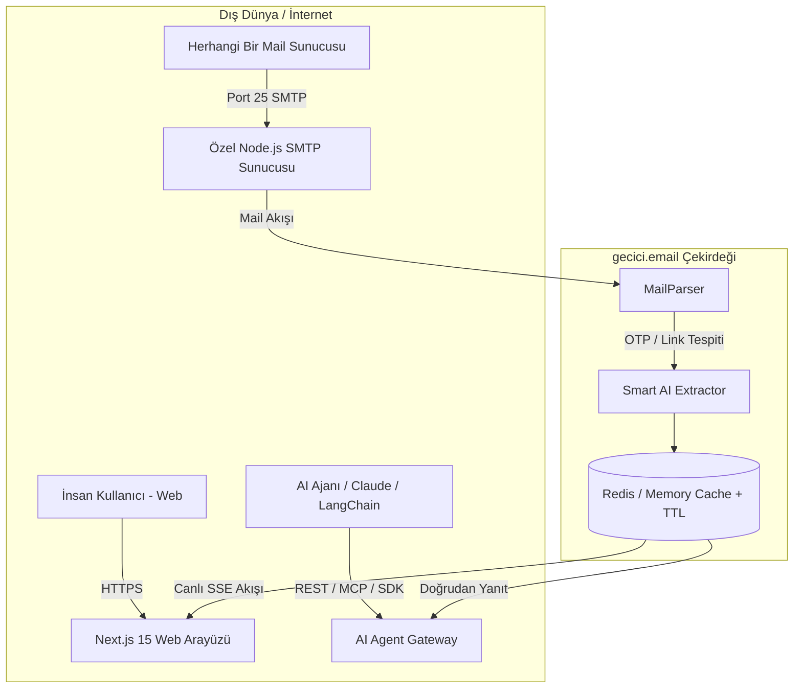

# ⚡ gecici.email - Bağımsız & AI-Native Geçici E-posta Servisi

> Hem insanlar hem de otonom **Yapay Zeka Ajanları (Claude, OpenAI, Cursor, LangChain, CrewAI, AutoGPT)** için sıfırdan geliştirilmiş bağımsız, ultra hızlı ve Google SEO standartlarında tek kullanımlık geçici e-posta altyapısı.

---

## 🌟 Öne Çıkan Özellikler

- 🚀 **0ms Gecikmeli Canlı Gelen Kutusu:** Server-Sent Events (SSE) ile sayfa yenilemeden e-postaların milisaniyeler içinde düşmesi ve sesli uyarı.
- 🤖 **Yapay Zeka (AI) & MCP Desteği:** Claude Desktop, Cursor veya LLM ajanları için Model Context Protocol (MCP) sunucusu.
- 🔑 **Akıllı OTP & Magic Link Ayrıştırıcı:** 4-8 haneli doğrulama kodlarını (`893120`, `449-012`), şifre sıfırlama linklerini ve aktivasyon butonlarını doğrudan JSON olarak döner.
- 🛡️ **Google Uyumlu & Güvenli Altyapı:**
  - **Sıfır CLS (Cumulative Layout Shift):** Reklam ve içerik alanlarında layout kaymasını engelleyen rezerve mimari.
  - **JSON-LD Schema:** `WebApplication`, `FAQPage`, `HowTo` yapılandırılmış verileri.
  - **İzole Sandboxed HTML Görüntüleme:** XSS ve kötü amaçlı scriptlere karşı tam koruma.
  - **Receive-Only:** Giden portlar kapalı olduğu için IP/Domain asla kara listeye (blacklist) girmez.
- 📦 **Tek Komutla Dağıtım:** Docker Compose ile SMTP dinleyicisi, REST/SSE API ve Next.js arayüzü 1 dakikada ayakta.

---

## 🏗️ Sistem Mimarisi



---

## 🚀 Hızlı Başlangıç (Docker ile 1 Dakikada Kurulum)

### 1. Depoyu İndirin ve Konfigüre Edin
```bash
cd gecici-email
cp server/.env.example server/.env
```

### 2. Docker Compose ile Başlatın
```bash
docker compose up -d --build
```
* 🌐 **Web Arayüzü:** `http://localhost:3100`
* ⚡ **REST & SSE API:** `http://localhost:4000`
* 📬 **Inbound SMTP Sunucusu:** `Port 25` (veya `Port 2525`)

---

## 🤖 AI Ajanları & MCP (Model Context Protocol) Kurulumu

Claude Desktop, Cursor veya Google Antigravity için `claude_desktop_config.json` dosyanıza ekleyin:

```json
{
  "mcpServers": {
    "gecici-email": {
      "command": "npx",
      "args": ["-y", "gecici-email-mcp"]
    }
  }
}
```

### Python SDK Kullanımı (`pip install gecici-email`)
```python
from gecici import GeciciEmail

# AI Ajanı tek satırda gelen kutusu oluşturur
with GeciciEmail() as inbox:
    print(f"Ajan E-postası: {inbox.address}")
    
    # Web sitesindeki kayıt butonuna bastıktan sonra doğrulama kodunu bekle:
    otp_code = inbox.wait_for_otp(timeout=30)
    print(f"Yakalanan Doğrulama Kodu: {otp_code}")
```

### TypeScript / Node.js SDK Kullanımı (`npm i gecici-email`)
```typescript
import { GeciciEmail } from 'gecici-email';

const client = new GeciciEmail();
const inbox = await client.createInbox();
console.log('E-posta:', inbox.address);

const otp = await client.waitForOtp(inbox.address, 30);
console.log('Doğrulama Kodu:', otp);
```

---

## 📡 REST & SSE API Uç Noktaları

| Metod | Uç Nokta | Açıklama |
| :--- | :--- | :--- |
| `POST` | `/api/v1/inbox/generate` | Yeni rastgele e-posta kutusu oluşturur |
| `POST` | `/api/v1/inbox/custom` | Özel kullanıcı adlı e-posta açar |
| `GET` | `/api/v1/inbox/:address/messages` | Gelen e-postaları listeler |
| `GET` | `/api/v1/inbox/:address/stream` | **SSE:** Canlı milisaniyelik e-posta akışı |
| `GET` | `/api/v1/inbox/:address/otp` | **AI:** Gelen e-postadaki OTP kodunu doğrudan döner |
| `GET` | `/api/v1/inbox/:address/links` | **AI:** Aktivasyon / sihirli linki döner |
| `DELETE` | `/api/v1/inbox/:address` | Gelen kutusunu ve tüm postaları bellekten siler |

---

## 🌐 Canlı Domain & DNS Yapılandırması (`gecici.email`)

Canlı sunucuda mailleri doğrudan alabilmek için domain DNS panelinizde (Cloudflare / Namecheap / vb.):

1. **A Kaydı:** `mail.gecici.email` -> `[Sunucunuzun Statik IP Adresi]`
2. **MX Kaydı:** `gecici.email` (Öncelik: 10) -> `mail.gecici.email`
3. **SPF Kaydı (TXT):** `v=spf1 -all` *(Yalnızca alıcı olduğumuz için giden maili engeller ve domain itibarını korur)*

---

## 📄 Lisans

MIT License - Açık kaynak ve ticari kullanıma uygundur.
